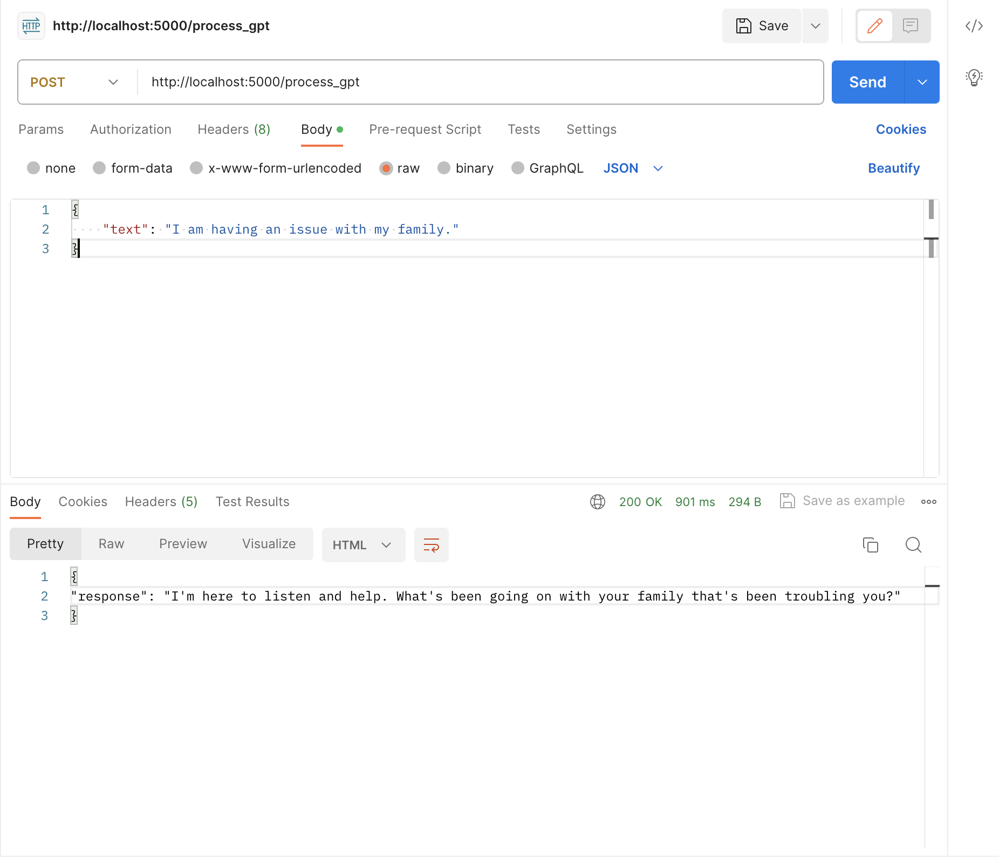

## Mindflow

#### Problem Statement:
Ever since the COVID-19 pandemic, there has been a surge in mental health services demand for University students, following a more general trend at the national and global level. At Columbia, the demand for Counseling and Psychological Services (CPS)  has greatly outgrown the supply of accessible, trained therapists who can provide quality care to students promptly. While opportunities like telehealth to speak virtually with healthcare providers exist within the University, these services do not cover mental health services. Finally, students who are patients of mental health professionals often do not receive an adequate amount of time when undergoing treatment, which ultimately diminishes the quality of their care.

#### Target Population:

Columbia University undergraduate students actively seeking and utilizing professional mental health services.

### What is Mindflow?
MindFlow is a journal app that provides two main features for mental health: structured journaling based on therapist-provided topics and a freeform journaling mode for personal reflection. Patients start on the homepage, selecting either a topic from their therapist or the freeform option and enter a chat interface with an AI that helps guide their reflection with open-ended questions (without replacing a licensed professional). After an emotional outpouring, the user can choose to save their reflection with their therapist or to keep it stored locally. 

Therapists can tailor journal prompts for their patients and review and provide feedback on the entries within the app. This feedback is then available for patients to view on their logs page, ensuring an ongoing, interactive therapeutic process.

### Running Our Code:

All our static screens are located in the mindflow_frontend folder, built and created with Flutter. 

Ensure you have flutter installed and the associated development utilities with

`$ flutter doctor`

Ensure you are in the /mindflow_frontend folder, and the run the following command to run our Flutter app.

`$ flutter run`

** Side note, you will need to have XCode or Android Studio installed for testing/viewing on iOS or Android platforms. We tested on iOS because we had Macbooks. In our case we have a device simulator installed and open by running `$ open -a Simulator`

For our backend, we built a Flask server and used a python virtual env for package management. Create your respective venv using the `requirements.txt` file in the /backend folder.

Run the Flask backend server once you are in the /backend folder with the `python app.py` command.

This will launch the availability of one of our `/process_gpt` endpoint. It takes some text and sends it to GPT (with some context) and returns a JSON response.

